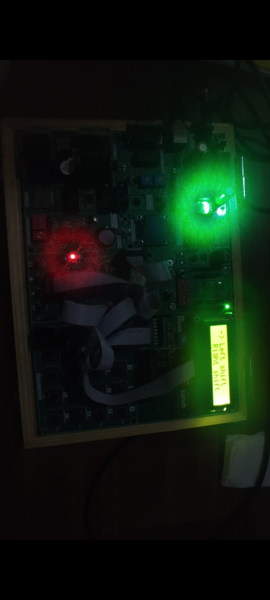

# LED Pattern Selector using LCD and Push Buttons | ESP32 DevKit

## 🎯 Aim

To implement a menu-driven LED pattern selector using an ESP32 DevKit, where users can navigate through pattern options on an LCD and control 8 LEDs using push buttons.

## 📖 Description

This project showcases how to build an interactive LED pattern controller using:
- 16x2 LCD display (non-I2C)
- 4 push buttons (Menu, Up, Down, Enter)
- 8 LEDs
- ESP32 DevKit module

### 🛠️ Features:
- Menu button to access the pattern selection screen
- Up/Down buttons to navigate through the menu
- Enter button to confirm pattern choice
- LCD shows pattern names two at a time
- Selected pattern runs on 8 LEDs in real-time

### Available Patterns:
1. Left Shift  
2. Right Shift  
3. Blink  
4. Fast Blink  
5. Right Arrow  
6. Left Arrow

## 🧠 Learnings

- Handling button interrupts and debouncing in ESP32
- Controlling 16x2 LCD using direct GPIO (without I2C)
- Implementing scrolling menu interfaces on LCD
- Managing multiple LED patterns using efficient logic
- Structuring code for better readability and modular design

## 📸 Output

  

