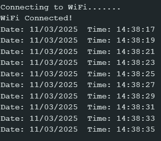

# 📌 Task 6: RTC NTP Server

## 📖 Description
A system built using the ESP32 and an I2C RTC module (DS1307) that synchronizes time from an NTP (Network Time Protocol) server and updates the RTC. The system fetches the current time from an NTP server over Wi-Fi and sets it to the RTC module, enabling accurate timekeeping on the device.

## 🎯 Aim
To synchronize the time of an I2C RTC module (DS1307) with an NTP server using the ESP32. This task ensures that the RTC maintains accurate time even after a reset or power cycle, with the time fetched and updated regularly.

## 🛠️ Features Implemented
- 🌐 NTP time synchronization over Wi-Fi
- 🕰️ Updates RTC time (DS1307) using the synchronized time
- 📡 Continuous real-time clock (RTC) display in the Serial Monitor
- ✅ Successful connection to Wi-Fi with fallback in case of failure
- ⏰ Automatic fetching of time from NTP and setting it to RTC

## ⚙️ Components Used
- ✅ ESP32 Devkit board
- ✅ DS1307 RTC module (I2C)
- ✅ Wi-Fi connectivity (for NTP synchronization)
- ✅ Serial Monitor for displaying time and date

## 🧠 Learnings
- Fetching time from an NTP server using ESP32
- Interfacing ESP32 with an I2C-based RTC module (DS1307)
- Converting and formatting time between different formats (BCD and decimal)
- Handling Wi-Fi connections and troubleshooting timeouts
- Synchronizing external devices (RTC) with network time

## ✅ Output
- The RTC time is continuously displayed in the Serial Monitor in the format `HH:MM:SS` and `DD/MM/YYYY`.
- Time is fetched from the NTP server and set to the DS1307 RTC module on startup.

  

- The system ensures the RTC remains accurate even after power cycles by syncing with NTP on boot.
