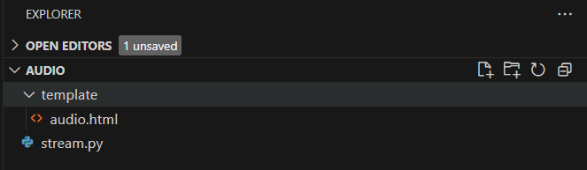
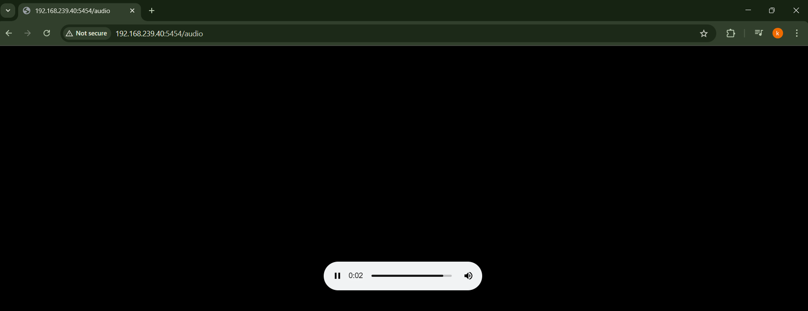
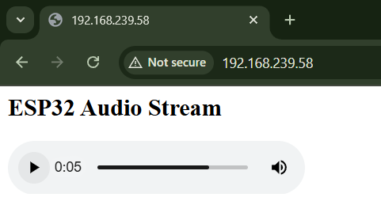

# 📌 Task 3: Online Audio Streaming

## 📖 Description
An Online Audio Streaming system built using an ESP32 dev board and a Flask server. The ESP32 hosts a web server that serves a webpage with an embedded audio player. This player streams audio content from a Flask server, allowing users to listen to the audio directly in their web browser.

## 🎯 Aim
To stream audio from a Flask server to an ESP32 web server, enabling playback in a browser using an HTML5 audio player.

## 🛠️ Features Implemented
- 🌐 ESP32 Web Server that serves the audio streaming webpage
- 🎵 Streaming of audio content from a Flask server
- 🎧 Embedded HTML5 audio player for browser-based playback
- 🔄 Real-time audio streaming with `audio/wav` format support

## ⚙️ Components Used
- ✅ ESP32 Devkit board
- ✅ Wi-Fi connectivity (for connecting ESP32 to the local network)
- ✅ Web browser (for accessing the ESP32 webpage and playing audio)
- ✅ Flask server (serving audio content over HTTP)

## 🧠 Learnings
- Setting up a basic web server on the ESP32
- Streaming audio content from a Flask server to a browser
- Using HTML5 `<audio>` element for streaming audio
- Connecting ESP32 to a local Wi-Fi network for communication

## ✅ Output
- A simple webpage is hosted by the ESP32 with an embedded audio player.
  

  
  

- The audio player streams the content served from the Flask server.
  

  

- The audio plays automatically upon opening the webpage in a browser.

  

