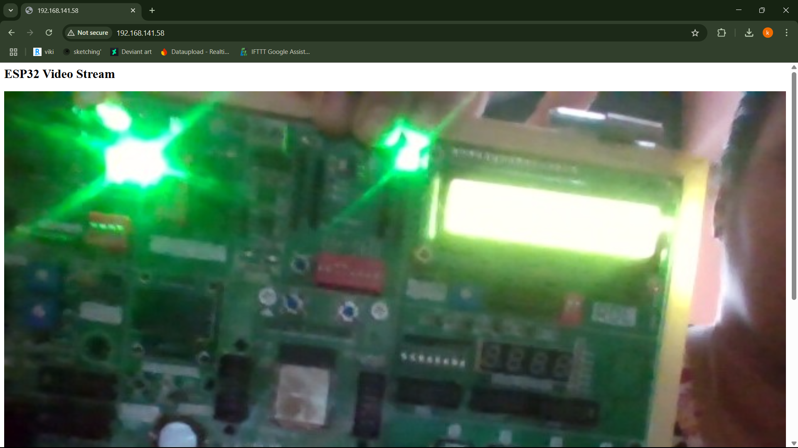
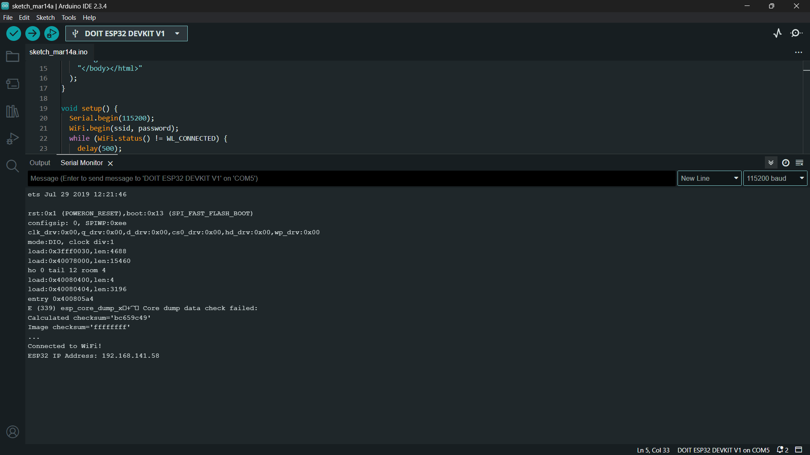

# 📌 Task 4: Online Video Streaming

## 📖 Description
An Online Video Streaming system built using an ESP32 dev board and a Flask server. The ESP32 hosts a web server that serves a webpage with an embedded video player. This player streams video content from a Flask server, allowing users to watch the video directly in their web browser.

## 🎯 Aim
To stream video from a Flask server to an ESP32 web server, enabling playback in a browser using an HTML `` element or `<video>` player.

## 🛠️ Features Implemented
- 🌐 ESP32 Web Server that serves the video streaming webpage
- 🎥 Streaming of video content from a Flask server
- 🎬 Embedded video player for browser-based playback
- 🔄 Real-time video streaming over HTTP

## ⚙️ Components Used
- ✅ ESP32 Devkit board
- ✅ Wi-Fi connectivity (for connecting ESP32 to the local network)
- ✅ Web browser (for accessing the ESP32 webpage and watching the video)
- ✅ Flask server (serving video content over HTTP)

## 🧠 Learnings
- Setting up a basic web server on the ESP32
- Streaming video content from a Flask server to a browser
- Using HTML `` or `<video>` element for streaming video
- Connecting ESP32 to a local Wi-Fi network for communication

## ✅ Output
- A simple webpage is hosted by the ESP32 with an embedded video player.
- The video player streams the content served from the Flask server.
  
- The video plays automatically upon opening the webpage in a browser.
  
